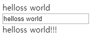
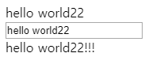
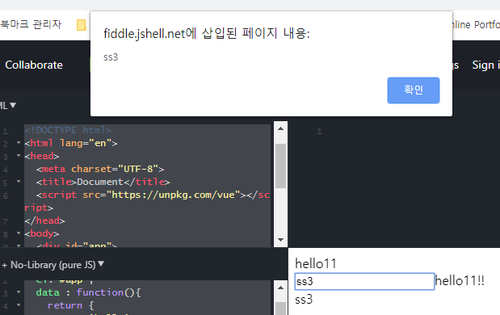

## #들어가기 전에

`# ssr(서버 사이드 랜더링)` 
- 랜더링이란? : 어떠한 웹 접속시, 그 페이지를 화면에 그려주는 것
- 서버사이드 랜더링 : 요청 시 마다, 새로고침이 일어나며 서버에 새로운 페이지에 대한 요청을 하는 방식이다
  - https://goodgid.github.io/Server-Side-Rendering-and-Client-Side-Rendering/
  - https://asfirstalways.tistory.com/244
  
- `view` : 보여지는 화면
- `model` : 내부적으로 사용하는 데이터, 데이터를 다루는 로직
  - 데이터 변화가 일어나면, 서로 업데이트 해 주는 것 : `양방향 데이터 바인딩`
  
- `React`
  - virtual dom : 페이지를 거슬러 올라가며 변경하는 것이 아니라, 한 부분에서 변화가 일어나면 그 부분만 바꿈
  - 단방향 데이터 바인딩 : 부모 -> 자식 단계로만 데이터 바인딩이 일어나서 구조 파악에 용이
    - 자식 컴포넌트에서 변화가 일어나면 emit으로 부모 컴포넌트 요소 변경
    
---

## #실습

### #1
```html
<!DOCTYPE html>
<html lang="en">
<head>
  <meta charset="UTF-8">
  <title>Document</title>
  <script src="https://unpkg.com/vue"></script>
</head>
<body>
  <div id="app">
    {{ msg }}
  </div>
  
  <script>
    new Vue({
      el: '#app',
      data: function(){
        return {
          msg: 'hello world'
        }
      }
    });
  </script>
</body>
</html>
```
> //hello world가 찍힘

### #2
```html
<html lang="en">
<head>
  <meta charset="UTF-8">
  <title>Document</title>
  <script src="https://unpkg.com/vue"></script>
</head>
<body>
  <div id="app">
    <span v-bind:title="msg">마우스를 올려보세요</span>
  </div>
  
  <script>
    new Vue({
      el:'#app',
      data:function(){
        return {
          msg: 'hello world',
        };
      },
    });
  </script>  
</body>
</html>
```
> //'마우스를 올려보세요'라고 출력된 곳에 마우스를 대면 말풍선으로 msg의 내용이 출력됨

### #3
```html
<!DOCTYPE html>
<html lang="en">
<head>
  <meta charset="UTF-8">
  <title>Document</title>
  <script src="https://unpkg.com/vue"></script>
</head>
<body>
  <div id="app">
    <input type="text" v-model="msg">
    <br>
    <span v-if="!flag">flag가 참일 때 보임 / 화면에 그리지 않음</span>
    <span v-else-if="msg.length > 1">msg 조건</span>
    <span v-else>flag가 거짓일 때 보임</span>
    <br>
  </div>
  
  <script>
    new Vue({
      el:'#app',
      data:function(){
        return {
          msg: 'hello world',
          flag :false,
          array: [1,2,3,4,5],
        };
      },
    });
  </script>
</body>
</html>
```
- 결과
> 

### #4
```html
<!DOCTYPE html>
<html lang="en">
<head>
  <meta charset="UTF-8">
  <title>Document</title>
  <script src="https://unpkg.com/vue"></script>
</head>
<body>
  <div id="app">
    <span v-show="!flag">v-show는 일단 화면에 그려짐 / display:none</span>
    <br>
  </div>
  
  <script>
    new Vue({
      el:'#app',
      data:function(){
        return {
          flag :false,
        };
      },
    }); 
  </script>
</body>
</html>
```
> //v-show는 일단 화면에 그려짐 / display:none 라고 출력됨

### #5 
```html
<!DOCTYPE html>
<html lang="en">
<head>
  <meta charset="UTF-8">
  <title>Document</title>
  <script src="https://unpkg.com/vue"></script>
</head>
<body>
  <div id="app">
    <li v-for="(arr, idx) in array">{{ arr }} [{{ idx }}]</li>
  </div>
  
  <script>
    new Vue({
      el:'#app',
      data:function(){
        return {
          array: [1,2,3,4,5],
        };
      },
    }); 
  </script>
</body>
</html>
```
- 결과
> 

### #6
```html
<!DOCTYPE html>
<html lang="en">
<head>
  <meta charset="UTF-8">
  <title>Document</title>
  <script src="https://unpkg.com/vue"></script>
</head>
<body>
  <div id="app">
    <button v-on:click="say">say</button>
    <button v-on:click="read">read</button>
  </div>
  
  <script>
    new Vue({
      el:'#app',
      data:function(){
        return {
          msg: 'hello world',
        };
      },
      methods: {
        say: function(){
          console.log('dd');
        },
        read: function(){
          console.log(this.msg);
        },
      },
    }); 
  </script>
</body>
</html>
```  
> //console에 각각 dd, helloworld가 출력됨

### #7
```html
<!DOCTYPE html>
<html lang="en">
<head>
  <meta charset="UTF-8">
  <title>Document</title>
  <script src="https://unpkg.com/vue"></script>
</head>
<body>
  <div id="app">
    {{ msg }}
    <br>
    <input type="text" v-model="msg">
    <br> 
    {{ msg2 }}
    <br>
    <span v-if="!flag">flag가 참일 때 보임 / 화면에 그리지 않음</span>
  </div>
  
  <script>
    new Vue({
      el:'#app',
      data:function(){
        return {
          msg: 'hello world',
          flag :false,
        };
      },
      computed: { 
        msg2: function(){
          //this.msg = 'test'; //이런식으로 쓰면 안됨
          //감지는 하지만 데이터를 건드리는 작업을 하면 안 됨
          return this.msg + '!!!';
          //watch만큼 당장 바꾸지 않아도 될 데이터를 호출할 때
        },
      },
    });
  </script>
</body>
</html>
```
- 결과
> 
- `computed`
  - 함수 아님
  - 값을 리턴하기 때문임
  - computed 자체가 computed에 선언된 함수 리턴값의 결과임
  - 그러므로, input에 다르게 값을 변경하면 computed가 작동, {{ msg2 }}도 바뀜
  - 즉, data의 변경값을 계산하는 계산된 속성
  - watch 처럼 당장 바꾸지 않아도 될 데이터를 호출할 때 사용

```html
<!DOCTYPE html>
<html lang="en">
<head>
  <meta charset="UTF-8">
  <title>Document</title>
  <script src="https://unpkg.com/vue"></script>
</head>
<body>
  <div id="app">
    {{ msg }}
    <br>
    <input type="text" v-model="msg">
    <br> 
    {{ msg2 }}
  </div>
  
  <script>
    new Vue({
      el:'#app',
      data:function(){
        return {
          msg: 'hello world',
        };
      },
      computed: { 
        msg2: function(){ 
          return this.msg + '!!!';
        },
      },
      watch: { 
        msg: function(){
          this.flag = true; 
          alert('changed');
        }
      },
    }); 
  </script>
</body>
</html>
```
- 결과
> 
- `watch`
  - 코드 상, input의 값을 바꿀 때마다 'changed'가 출력된 alert가 뜸
  - this.flag = true 와 같이 데이터를 변경할 수 있음
  - 인스턴스 내부에서 데이터를 건드리는 작업을 함

```html
<!DOCTYPE html>
<html lang="en">
<head>
  <meta charset="UTF-8">
  <title>Document</title>
  <script src="https://unpkg.com/vue"></script>
</head>
<body>
  <div id="app">
    {{ msg }} <br>
    <input type="text" v-model="msg2">{{comp}}<br>
    {{ msg2 }}
  </div>
  
  <script>
    new Vue({
      el:'#app',
      data : function(){
        return {
          msg: 'hello',
          msg2:'ss',
        }
      },
      computed: {
        comp:function(){
          return this.msg + '!!';
        }
      },
      watch:{
        msg2:function(){
          this.msg = this.msg + '1';
          alert(this.msg2);
        }
      }
    }); 
  </script>
</body>
</html>
```
- 결과
> 
- `watch`
  - watch의 특성 상 변하기 전의 값과(v-model="msg2"), 그 값을 변형할 수 있는 장치(input)가 있어야 함
  

