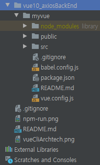

# Vue-for-beginner

- 실행하기

<모델-뷰-뷰모델 MVVM 구성요소>
<li>모델: 도메인 영역 담당. 데이터와 비즈니스 로직 등을 표현</li>
<li>뷰: 데이터를 사용자가 보기에 적합한 형태로 표시하고 사용자의 입력을 받음</li>
<li>뷰모델: 뷰를 그리기 위한 상태 유지, 뷰에서 받은 입력을 적절한 형태로 변환하여 모델에 전달</li>
   
<table>
  <tr>
    <td>IDE
    <td>Webstorm
  </tr>
  <tr>
    <td>프로젝트 생성
    <td>File - new project - [new project] - [Vue.js]선택 - Location(폴더 이름) - Vue CLI:npx --package @vue/cli vue
  </tr>
  <tr>
    <td colspan=2>(프로젝트 생성 대기 - cli 나중에 설치하려면 그냥 empty project로 프로젝트 생성)
  </tr>
  <tr>
    <td>node.js 설치하기
    <td>https://chrome.google.com/webstore/detail/vuejs-devtools/nhdogjmejiglipccpnnnanhbledajbpd (vue.js devtools)
  </tr>
  <tr>
    <td>vue 개발자 도구 설치하기
    <td>https://nodejs.org/ko/download/ (LTS) 
  </tr>
  <tr>
    <td>cdn
    <td>
      <li></li>
      <li>(라우터)</li>
      <li>(뷰 리소스)</li>
      <li>(axios)</li>
  </tr>
  <tr>
    <td>vue.js devtool 화살표 표시(개발자 도구)
    <td>
      <li>Root 컴포넌트 : 최상위 컴포넌트</li>
  </tr>
  <tr>
    <td colspan=2><b>***뷰 인스턴스 라이프 사이클 : 인스턴스의 상태에 따라 호출할 수 있는 속성들</b>
  </tr>
  <tr>
    <td>beforeCreate
    <td>data, methods 속성이 인스턴스에 미정, 화면요소에 접근x
  </tr>
  <tr>
    <td>created
    <td>data, methods속성 정의, template 화면요소 접근x
  </tr>
  <tr>
    <td>beforeMount
    <td>render()함수 호출되기 직전
  </tr>
  <tr>
    <td>mounted
    <td>el 화면요소 인스턴스 부착 후 호출 단계, template 화면요소 접근ㅇ
  </tr>
  <tr>
    <td>beforeUpdate
    <td>데이터 변경 시 화면을 다시 그리기 전에 호출되는 단계
  </tr>
  <tr>
    <td>updated
    <td>데이터 변경후 화면 요소 변경 완료된 시점
  </tr>
  <tr>
    <td>beforeDestroy
    <td>뷰 인스턴스 파괴 직전 호출단계
  </tr>
  <tr>
    <td>destroyed
    <td>뷰 인스턴스 파괴 후 호출단계, 뷰 인스턴스에 정의한 모든 속성 제거
  </tr>
  <tr>
    <td>Vue CLI 명령어
    <td>
      <li>
        <b>[순서] npm install vue-cli -g(뷰 CLI설치) / vue init webpack-simple(프로젝트 생성) / npm install(프로젝트 구동) / npm run dev(구동)</b>
      </li>
      <li>Vue CLI 2 삭제(충돌방지) : npm r -g vue-cli</li>
      <li>Vue CLI 3 설치 : npm i -g @vue/cli</li>
      <li>버전 확인 : vue --version</li>
      <li>디렉토리 생성 : 위치 지정 후 vue create [폴더 이름]</li>
      <li>실행 : 위치 지정 후 npm run serve</li>
      <li>프로세스 종료(터미널) : ctrl + c</li>
      <li>npm init : package.json을 만드는 명령어</li>
      <li>npm 모듈 설치(로컬): npm install(package.json 파일 및 해당 종속성에 나열된 모든 모듈을 설치)</li>
      <li>npm 모듈 설치(전역): npm install -g</li>
      <li>npm 모듈 업데이트 : npm update</li>
      <li>npm 모듈 삭제 : npm uninstall</li>
      <li>axios 설치 : npm install axios</li>
  </tr>
  <tr>
    <td colspan=2><b>***npm(Node Packaged Manager)이란 무엇인가?</b>
  </tr>
  <tr>
    <td colspan=2>  
      <li>정의 : 자바스크립트 프로그래밍 언어를 위한 패키지 관리자</li>
      <li>자바스크립트 런타임 환경 Node.js의 기본 패키지 관리자</li>
      <li>Node.js로 만들어진 package(module)을 관리해주는 툴</li>
      <li>Node.js로 만들어진 모듈을 웹에서 받아 설치하고 관리해주는 프로그램(maven과 비슷)</li>
      <li>이후 모듈 업데이트가 필요할 시 알려줌(버전관리가 용이함)</li>
      <li>예전에는 npm을 따로 설치해야 했지만 지금은 node.js를 설치하면 내장(built in)되어 있음</li>
      <li>https://m.blog.naver.com/magnking/220961896609</li>
      <li>http://itnovice1.blogspot.com/2019/01/js-npm.html</li>
  </tr>
  <tr>
    <td>Vue CLI 폴더, 요소
    <td>
      <li>[node_modules] : npm install 명령어로 다운받은 라이브러리가 존재하는 위치</li>
      <li>[src] : .vue 파일을 비롯하여 애플리케이션이 동작하는 데 필요한 로직이 들어갈 위치</li>
      <li>[public] - index.html : 뷰로 만든 웹 앱의 시작점(npm run deb 실행 시 로딩되는 파일)</li>
      <li>package.json : npm 설정 파일(뷰 애플리케이션이 동작하는 데 필요한 라이브러리들을 정의하는 파일)</li>
      <li>webpack.config.js : 웹팩 설정 파일(웹팩 빌드를 위해 필요한 로직들을 정의하는 파일)</li>
  </tr>
  <tr>
    <td colspan=2><b>***package.json 구조</b>
  </tr>
  <tr>
    <td colspan=2>
      <li>name, description, version, author : 프로젝트 정보</li>
      <li>scripts{dev, build} : npm 실행 명령어</li>
      <li>dependencies{}, devDependencies{} : 뷰, 웹팩 관련 라이브러리</li>
      -프로젝트 정보를 담고 있는 설정 파일  
      -npm 명령어 및 부로 애플리케이션을 제작하는 데 필요한 라이브러리 정보들을 포함  
  </tr>
  <tr>
    <td>브라우저 저장소의 종류
    <td>로컬 스토리지, 세션 스토리지, 인덱스드 디비
  </tr>
  <tr>
    <td colspan=2><b>***여러가지 문법, 규칙</b>
  </tr>
  <tr>
    <td colspan=2><li>npm install 을 다시 해야 하는 경우 : 다른 사람의 프로젝트를 내려받았는데, package.json에 등록된 라이브러리가 node_modules에 다운로드 되지 않았을 때</li>
  </tr>
  <tr>
    <td colspan=2><li>axios = ajax(프론트엔드 - 백엔드 간 통신)</li>
  </tr>
  <tr>
    <td colspan=2><li>_ : lodash의 변수명 (ex) _.shuffle(answers); </li>
  </tr>
  <tr>
    <td colspan=2>
      <li>... : 객체의 변수들을 전개함(전개 연산자)</li>
      ㄴ뒤에 객체가 있으면 객체 안의 element를 전개함(밖으로 하나하나 다 뺌) 
      (ex) [...this.currentQuestion.incorrect_answers] => [1번째부터 차례로,2번재,3번째,4,5,6...]
  </tr>
  <tr>
    <td>
    <td>
  </tr>
</table>

---

- 각 디렉토리의 특징 및 존재의미
<table>
  <tr>
    <td>File or Folder
    <td>meaning
  </tr>
  <tr>
    <td>public
    <td>
      <li>public 폴더 내 요소는 외부에서 접근가능</li>
      <li>http://localhost:9999/nnn/logo.png 이런식으로 주소 치면 접근할 수 있음</li>
  </tr>
  <tr>
    <td>
    <td>
  </tr>
</table>

## reference
- ui framework
  - https://vuetifyjs.com/ko/
  - https://element.eleme.io/#/en-US/component/input
  - https://quasar.dev/
- reference
  - https://medium.com/witinweb/vue-js-%EB%9D%BC%EC%9D%B4%ED%94%84%EC%82%AC%EC%9D%B4%ED%81%B4-%EC%9D%B4%ED%95%B4%ED%95%98%EA%B8%B0-7780cdd97dd4
  - https://niceman.tistory.com/55
  - https://cli.vuejs.org/config/#devserver-proxy
  - https://www.youtube.com/watch?v=4deVCNJq3qc
  - https://github.com/axios/axios
  - https://joshua1988.github.io/web-development/vuejs/vue-structure/
  - https://jamong-icetea.tistory.com/201
  - https://m.blog.naver.com/magnking/220961896609
  - https://seulcode.tistory.com/261
  - https://blog-han.tistory.com/30
  - https://imasoftwareengineer.tistory.com/41
  - https://velog.io/@n2ptune/NPM%EC%97%90%EC%84%9C-save%EC%99%80-save-dev%EC%9D%98-%EC%B0%A8%EC%9D%B4%EC%A0%90
  - https://joshua1988.github.io/web-development/translation/essential-es6-features-for-vuejs/
