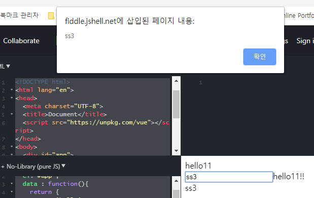

## #들어가기 전에

`# ssr(서버 사이드 랜더링)`

- 랜더링이란? : 어떠한 웹 접속시, 그 페이지를 화면에 그려주는 것
- 서버사이드 랜더링 : 요청 시 마다, 새로고침이 일어나며 서버에 새로운 페이지에 대한 요청을 하는 방식이다
    - https://goodgid.github.io/Server-Side-Rendering-and-Client-Side-Rendering/
    - https://asfirstalways.tistory.com/244

- `view` : 보여지는 화면
- `model` : 내부적으로 사용하는 데이터, 데이터를 다루는 로직
    - 데이터 변화가 일어나면, 서로 업데이트 해 주는 것 : `양방향 데이터 바인딩`

- `React`
    - virtual dom : 페이지를 거슬러 올라가며 변경하는 것이 아니라, 한 부분에서 변화가 일어나면 그 부분만 바꿈
    - 단방향 데이터 바인딩 : 부모 -> 자식 단계로만 데이터 바인딩이 일어나서 구조 파악에 용이
        - 자식 컴포넌트에서 변화가 일어나면 emit으로 부모 컴포넌트 요소 변경

---

## #실습

### #1

```html
<!DOCTYPE html>
<html lang="en">
<head>
  <meta charset="UTF-8">
  <title>Document</title>
  <script src="https://unpkg.com/vue"></script>
</head>
<body>
<div id="app">
  {{ msg }}
</div>

<script>
  new Vue({
    el: '#app',
    data: function () {
      return {
        msg: 'hello world'
      }
    }
  });
</script>
</body>
</html>
```

> //hello world가 찍힘

### #2

```html

<html lang="en">
<head>
  <meta charset="UTF-8">
  <title>Document</title>
  <script src="https://unpkg.com/vue"></script>
</head>
<body>
<div id="app">
  <span v-bind:title="msg">마우스를 올려보세요</span>
</div>

<script>
  new Vue({
    el: '#app',
    data: function () {
      return {
        msg: 'hello world',
      };
    },
  });
</script>
</body>
</html>
```

> //'마우스를 올려보세요'라고 출력된 곳에 마우스를 대면 말풍선으로 msg의 내용이 출력됨

### #3

```html
<!DOCTYPE html>
<html lang="en">
<head>
  <meta charset="UTF-8">
  <title>Document</title>
  <script src="https://unpkg.com/vue"></script>
</head>
<body>
<div id="app">
  <input type="text" v-model="msg">
  <br>
  <span v-if="!flag">flag가 참일 때 보임 / 화면에 그리지 않음</span>
  <span v-else-if="msg.length > 1">msg 조건</span>
  <span v-else>flag가 거짓일 때 보임</span>
  <br>
</div>

<script>
  new Vue({
    el: '#app',
    data: function () {
      return {
        msg: 'hello world',
        flag: false,
        array: [1, 2, 3, 4, 5],
      };
    },
  });
</script>
</body>
</html>
```

- 결과

> 

### #4

```html
<!DOCTYPE html>
<html lang="en">
<head>
  <meta charset="UTF-8">
  <title>Document</title>
  <script src="https://unpkg.com/vue"></script>
</head>
<body>
<div id="app">
  <span v-show="!flag">v-show는 일단 화면에 그려짐 / display:none</span>
  <br>
</div>

<script>
  new Vue({
    el: '#app',
    data: function () {
      return {
        flag: false,
      };
    },
  });
</script>
</body>
</html>
```

> //v-show는 일단 화면에 그려짐 / display:none 라고 출력됨

### #5

```html
<!DOCTYPE html>
<html lang="en">
<head>
  <meta charset="UTF-8">
  <title>Document</title>
  <script src="https://unpkg.com/vue"></script>
</head>
<body>
<div id="app">
  <li v-for="(arr, idx) in array">{{ arr }} [{{ idx }}]</li>
</div>

<script>
  new Vue({
    el: '#app',
    data: function () {
      return {
        array: [1, 2, 3, 4, 5],
      };
    },
  });
</script>
</body>
</html>
```

- 결과

> 

### #6

```html
<!DOCTYPE html>
<html lang="en">
<head>
  <meta charset="UTF-8">
  <title>Document</title>
  <script src="https://unpkg.com/vue"></script>
</head>
<body>
<div id="app">
  <button v-on:click="say">say</button>
  <button v-on:click="read">read</button>
</div>

<script>
  new Vue({
    el: '#app',
    data: function () {
      return {
        msg: 'hello world',
      };
    },
    methods: {
      say: function () {
        console.log('dd');
      },
      read: function () {
        console.log(this.msg);
      },
    },
  });
</script>
</body>
</html>
```  

> //console에 각각 dd, helloworld가 출력됨

### #7

```html
<!DOCTYPE html>
<html lang="en">
<head>
  <meta charset="UTF-8">
  <title>Document</title>
  <script src="https://unpkg.com/vue"></script>
</head>
<body>
<div id="app">
  {{ msg }}
  <br>
  <input type="text" v-model="msg">
  <br>
  {{ msg2 }}
  <br>
  <span v-if="!flag">flag가 참일 때 보임 / 화면에 그리지 않음</span>
</div>

<script>
  new Vue({
    el: '#app',
    data: function () {
      return {
        msg: 'hello world',
        flag: false,
      };
    },
    computed: {
      msg2: function () {
        //this.msg = 'test'; //이런식으로 쓰면 안됨
        //감지는 하지만 데이터를 건드리는 작업을 하면 안 됨
        return this.msg + '!!!';
        //watch만큼 당장 바꾸지 않아도 될 데이터를 호출할 때
      },
    },
  });
</script>
</body>
</html>
```

- 결과

> 

- `computed`
    - 함수 아님
    - 값을 리턴하기 때문임
    - computed 자체가 computed에 선언된 함수 리턴값의 결과임
    - 그러므로, input에 다르게 값을 변경하면 computed가 작동, {{ msg2 }}도 바뀜
    - 즉, data의 변경값을 계산하는 계산된 속성
    - watch 처럼 당장 바꾸지 않아도 될 데이터를 호출할 때 사용

```html
<!DOCTYPE html>
<html lang="en">
<head>
  <meta charset="UTF-8">
  <title>Document</title>
  <script src="https://unpkg.com/vue"></script>
</head>
<body>
<div id="app">
  {{ msg }}
  <br>
  <input type="text" v-model="msg">
  <br>
  {{ msg2 }}
</div>

<script>
  new Vue({
    el: '#app',
    data: function () {
      return {
        msg: 'hello world',
      };
    },
    computed: {
      msg2: function () {
        return this.msg + '!!!';
      },
    },
    watch: {
      msg: function () {
        this.flag = true;
        alert('changed');
      }
    },
  });
</script>
</body>
</html>
```

- 결과

> 

- `watch`
    - 코드 상, input의 값을 바꿀 때마다 'changed'가 출력된 alert가 뜸
    - this.flag = true 와 같이 데이터를 변경할 수 있음
    - 인스턴스 내부에서 데이터를 건드리는 작업을 함

```html
<!DOCTYPE html>
<html lang="en">
<head>
  <meta charset="UTF-8">
  <title>Document</title>
  <script src="https://unpkg.com/vue"></script>
</head>
<body>
<div id="app">
  {{ msg }} <br>
  <input type="text" v-model="msg2">{{comp}}<br>
  {{ msg2 }}
</div>

<script>
  new Vue({
    el: '#app',
    data: function () {
      return {
        msg: 'hello',
        msg2: 'ss',
      }
    },
    computed: {
      comp: function () {
        return this.msg + '!!';
      }
    },
    watch: {
      msg2: function () {
        this.msg = this.msg + '1';
        alert(this.msg2);
      }
    }
  });
</script>
</body>
</html>
```

- 결과

> 

- `watch`
    - watch의 특성 상 변하기 전의 값과(v-model="msg2"), 그 값을 변형할 수 있는 장치(input)가 있어야 함
  

